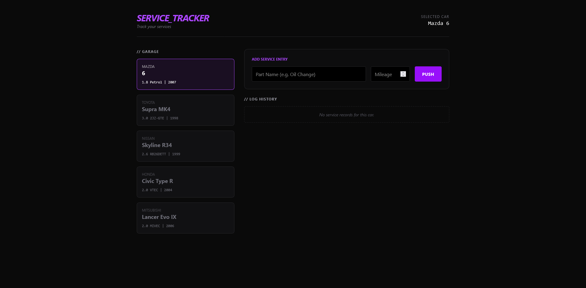
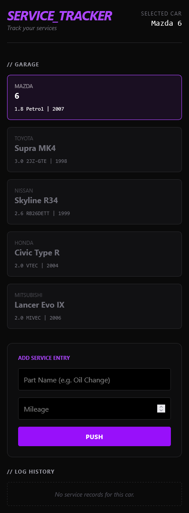

# Automotive maintenance tracker 👋

<div style="display: flex;">
  
  
</div>

## About 👀


Service Tracker. <br/>

Mobile version: yes!

### Key Features 🚀
* **Real-time Maintenance Tracking:** Add and manage service logs for multiple cars.
* **Persistent Data:** Uses `localStorage` to ensure your data survives browser restarts.
* **Fully Responsive:** Optimized for both desktop and mobile devices.
* **Modern Tech Stack:** Leveraging the power of React Hooks and Tailwind CSS.


## How can I try it? 🤔

Try now on: https://maintenancetrack.netlify.app/ <br/>

## Installation steps 📋

1. Copy this repository

```
gh repo clone BartoszBuko/automotive-maintenance-tracker
cd ./automotive-maintenance-tracker
```

or

```
git clone https://github.com/BartoszBuko/automotive-maintenance-tracker.git
cd ./automotive-maintenance-tracker
```

2. Type <code>npm run start</code> in your terminal

And that's all!

## About UX/UI 🖌️

I made design all by myself




<br>

## Technological facilities 🛠️

- React
- TypeScript 5.9.3
- TailWind CSS
